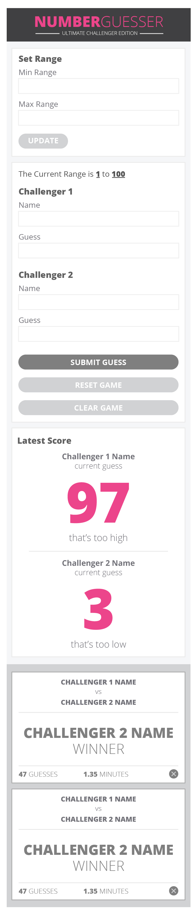

# Number Guesser Doubles (Pairing Project)

1. <a href="#1-purpose">Purpose</a>
2. <a href="#2-skills-acquired">Skills acquired</a>
3. <a href="#3-technology">Technology</a>
4. <a href="#4-features">Features</a>
5. <a href="#5-how-to-use">How to use</a>
6. <a href="#6-screenshots">Screenshots</a>
7. <a href="#7-credits">Credits</a>

## 1. Purpose

Number Guesser is a pair project assigned during week 2 of the Front End Engineering program at the Turing School of Software and Design. 

The purpose of the assignment is to create an interactive number guessing game, as pictured in section <a href="#6-screenshots">6. Screenshots</a>. The assignment provides a listing of functionality that must be programmed using vanilla JavaScript ES5.

The full assignment details are located on the [Turing website](http://frontend.turing.io/projects/number-guesser-doubles.html).

## 2. Skills acquired

  - Practice writing semantic HTML
  - Practice writing organized CSS
  - Practice writing DRY, organized JavaScript

## 3. Technology

  - HTML
  - CSS
  - JavaScript ES5

## 4. Features

  - Multiple buttons and input fields with associated event listeners and functions.
  - Dynamically generated content in the form of game cards that appear on the right side of the screen.
  - Multiple validation messages that appear based upon detected input.
  - Delete buttons located on dynamically generated content that utilize event bubbling to target the correct elements to remove.

## 5. How to use

  - Challengers may set a range and click the update button or begin playing immediately using the predefined range.
  - Challengers 1 and 2 enter their names and guesses, receiving an error message if any field is left blank.
  - Challengers submit their guesses, which are compared to a randomly generated number that is between the specified range.
  - The current guess, as well as a "hot or cold", message is displayed in the lower section.
  - If a challenger correctly guesses the randomly generated number, then a game card is generated and displayed on the right side of the page, showing various metrics about the game.
  - The game cards can be removed via the close button in the bottom right.

## 6. Screenshots

### 6.1 Provided composition

### 6.2 Recreated composition

Desktop:

Mobile:

## 7. Credits

The idea behind this assignment is credited to the Front End Engineering curriculum of the Turing School of Software and Design located in Denver, CO.
